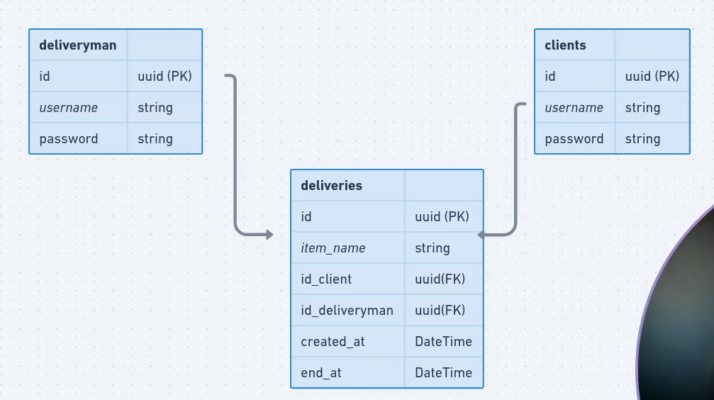

## O que você vai aprender/desenvolver

Neste módulo, você irá desenvolver uma aplicação no backend com Nodejs, utilizando o Prisma IO, para realizar entregas. Nesta aplicação, teremos de um lado o cliente - que irá se cadastrar e cadastrar itens para serem entregues em determinada localização - e, do outro, o entregador - que poderá pegar ou não determinada entrega para ser realizada. Iremos utilizar Typescript, JWT e Express.

### Initial Setup

yarn init -y

### Dependencies

<strong>Prisma IO</strong>
<strong>TypeScript</strong>
<strong>Bcrypt</strong>
<strong>JsonWebToken</strong>
<strong>Express</strong>
<strong>ts-node-dev</strong>

➜ yarn add typescript ts-node-dev @types/express @types/jsonwebtoken @types/bcrypt -D
➜ yarn add prisma -D
➜ yarn add express bcrypt jsonwebtoken @prisma/client
➜ yarn add express-async-errors

➜ yarn tsc --init

-> yarn prisma init
